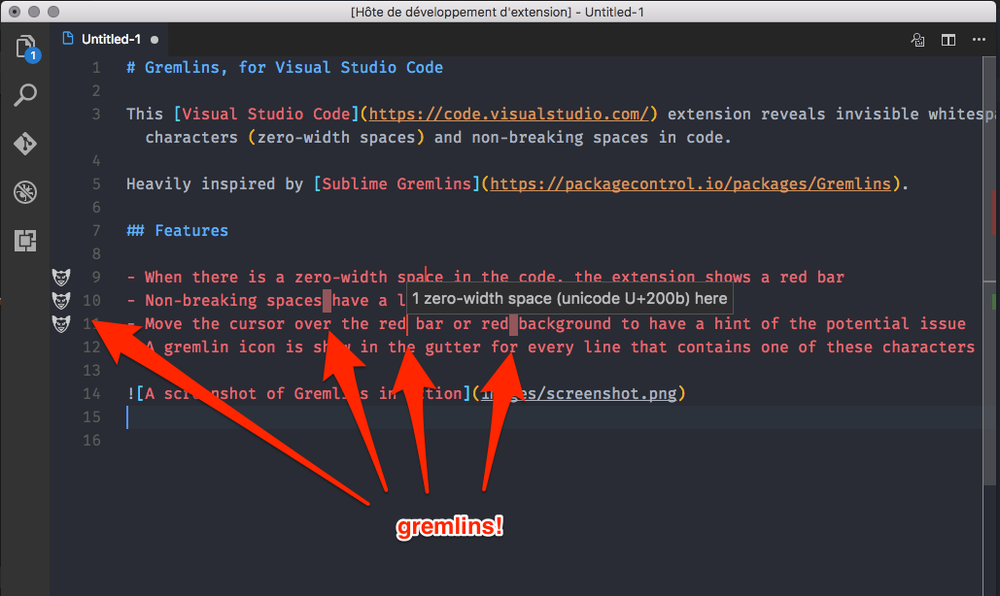

# Gremlins, for Visual Studio Code

This [Visual Studio Code](https://code.visualstudio.com/) extension reveals some characters that can be harmful because they are invisible or looking like legitimate ones.

## Features

- When there is a zero-width space in the code, the extension shows a red bar
- When there is a zero-width non-joiner in the code, the extension shows a red bar
- A few characters that can be harmful have a light red or orange background
  - Non-breaking spaces
  - Left and right double quotation marks
- Move the cursor over the character to have a hint of the potential issue
- A gremlin icon is shown in the gutter for every line that contains at least one of these characters

You can also use the [“Unicode code point of current character” extension](https://marketplace.visualstudio.com/items?itemName=zeithaste.cursorCharCode) to show information about the character under cursor in the status bar.

## Adding new gremlins characters

You can configure the list of characters and how they are shown under user settings key `gremlins.characters`.

Please help enhance the extension by suggesting new default characters, through Pull Requests or Issues.

# Standing on the shoulders of giants

VS Code Gremlins was initialy heavily inspired by [Sublime Gremlins](https://packagecontrol.io/packages/Gremlins), a [Sublime Text](https://www.sublimetext.com/) 3 plugin to help identify invisible and ambiguous Unicode whitespace characters (zero width spaces, no-break spaces, and similar.).

I later discovered the “Gremlins” name had already been used a long time before, in some editors:

[Bare Bones Software](http://www.barebones.com/)'s famous [BBEdit](http://www.barebones.com/products/bbedit/) HTML and text editor for macOS has a “Zap Gremlins” feature since [its first public release April 12th, 1992](https://groups.google.com/forum/#!topic/comp.sys.mac.announce/gvPGyuX3UCs)!

Here's how it looks in recent versions:

It looks like people liked this feature so much that they made [a dedicated website](http://zapgremlins.com/), unfortunately not anymore. Thanks Archive.org for [the cached version](https://web.archive.org/web/20120618091150/http://zapgremlins.com/):

